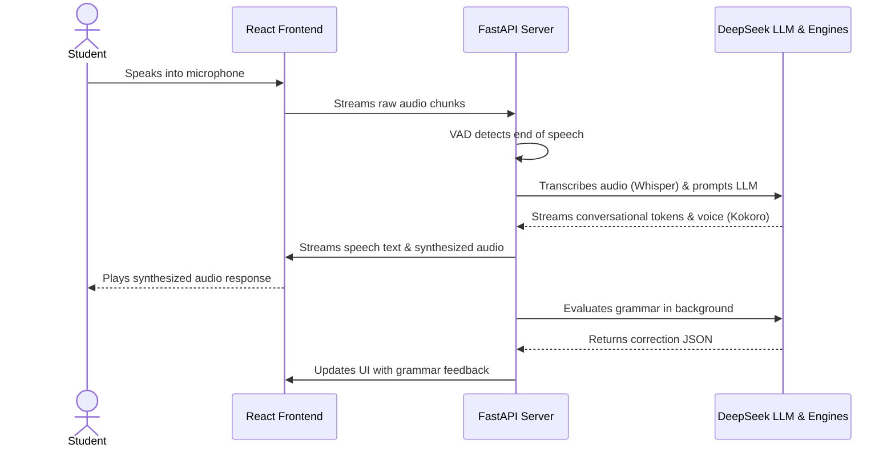

# Fluo.sh

A minimalist, voice-first AI language learner designed for natural, real-time conversations. **Fluō** listens, responds with lifelike voice streams, and provides non-intrusive, inline grammar corrections in real time.

---

## ⚡ Features

* **Voice-First Loop**: Speak naturally. Voice Activity Detection (VAD) automatically segments your speech and begins processing immediately.
* **Ultra-low Latency**: Powered by local STT (Faster-Whisper), fast TTS (Kokoro-ONNX), and DeepSeek LLM.
* **Sleek, Minimalist Interface**: Purely content-focused dark mode design, fully responsive from desktop down to mobile viewports.
* **Smart Feedback**: Interactive grammar corrections and suggestions for your spoken inputs.

---

## 🏗️ Architecture Flow

The diagram below shows how real-time audio streams, voice activation, and LLM processing orchestrate over WebSockets:



---

## 🛠️ Technology Stack

* **Frontend**: React, Vite, Lucide Icons, and Web Audio API queue.
* **Backend**: FastAPI, WebSockets, SQLite database.
* **VAD (Voice Activity Detection)**: Silero VAD `.onnx` running locally.
* **STT (Speech-to-Text)**: `faster-whisper` (utilizing CTranslate2 for local inference).
* **TTS (Text-to-Speech)**: `kokoro-onnx` local voice synthesis.
* **LLM Engine**: DeepSeek (standard model: `deepseek-chat`).

---

## 🚀 Quick Start (Docker)

Docker Compose orchestrates the frontend static server, local Python dependencies, and caching folder mounts automatically.

### 1. Configure Environment Variables

Copy `.env.example` to `.env` in the root directory:

```bash
cp .env.example .env
```

Edit the `.env` file to specify your LLM credentials:

```env
LLM_PROVIDER=deepseek
LLM_MODEL=deepseek-chat
DEEPSEEK_API_KEY=your_deepseek_api_key
DEEPSEEK_BASE_URL=https://api.deepseek.com/v1
```

### 2. Start Services

Run the following command to build and launch the application:

```bash
docker compose up -d --build
```

Access the web interface at: **[http://localhost:5173](http://localhost:5173)**.

---

## 💻 Local Development Setup (Non-Docker)

If you prefer to run the components natively on your system for debugging, follow these steps:

### Backend Setup

1. **Create Virtual Environment**:
   ```bash
   cd backend
   python3 -m venv venv
   source venv/bin/activate
   ```

2. **Install Dependencies**:
   ```bash
   pip install -r ../requirements.txt
   ```

3. **Run Dev Server**:
   ```bash
   uvicorn main:app --host 0.0.0.0 --port 8000 --reload
   ```

### Frontend Setup

1. **Install Modules**:
   ```bash
   cd frontend
   npm install
   ```

2. **Start Dev Server**:
   ```bash
   npm run dev
   ```

The frontend proxy will automatically direct API/WebSocket calls to `http://localhost:8000`.

---

## 📂 Directory Layout

```
.
├── backend/                  # FastAPI WebSocket backend
│   ├── db/                   # Local SQLite migration & queries
│   ├── llm/                  # Conversation agents & grammar feedback system
│   ├── stt/                  # Whisper transcription wrappers
│   ├── tts/                  # Kokoro-onnx voice synthesis wrapper
│   ├── vad/                  # Silero voice activity detection wrapper
│   └── ws/                   # WebSocket connection orchestrator
├── frontend/                 # React client application
│   ├── src/                  # React components and custom hooks
│   │   ├── audio/            # Gapless audio queue player hook
│   │   ├── components/       # Interface component elements
│   │   ├── hooks/            # WebSocket lifecycle controls
│   │   ├── index.css         # Styling system & mobile media queries
│   │   └── App.jsx           # Main workspace coordinator
│   └── public/               # Favicon & vector assets
├── docker-compose.yml        # Orchestration suite
└── README.md                 # Project documentation
```

---

## 📄 License

This project is open-sourced under the **MIT License**. Feel free to use, modify, and distribute it.